# Seeing Lost Enclaves
### Relational reconstructions of erased historic neighborhoods of color

_This is a draft. The final version will be published in September 2023._

## Part 3: Atmosphere

In this part of the Relational Reconstruction Toolkit, we'll be focusing on creating emotional space - through lighting, weather, textures and even movement. Here, I've worked with Alicia Renee Ball ([https://aliciareneeball.com](https://aliciareneeball.com)) - a multidisciplinary artist and designer - to explore how to create a sense of place and space through dynamic worldbuilding for our reconstruction models.  

If you've gone through the earlier parts of this guide, you may have a 3D model of a building or part of a neighborhood. But in your modeling program, you might feel that the scene lacks something -- that it doesn't jump out at you like a memory or a real place you could imagine yourself within.   

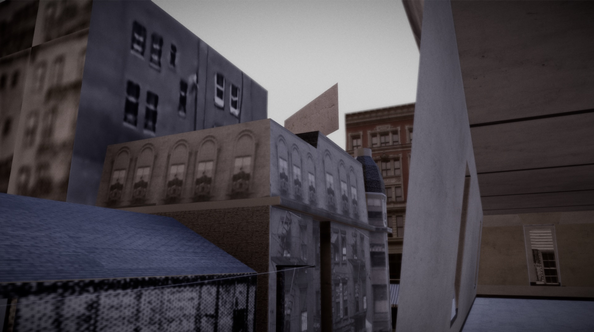
_Simulated evening/morning light in an early model of Providence's Chinatown._ 

The kinds of atmospheric effects we'll show help to create evocative moments, like in our strongest memories: the quiet of a snowstorm, or the feeling of a rainy day.   
  

## Providence Chinatown  

Lighting is the first, and maybe easiest way you can give your scene some emotional tone. Think about sunrise, or sunset, or other times of days which stand out in your memory -- maybe an especially hot day or even a snowstorm.   

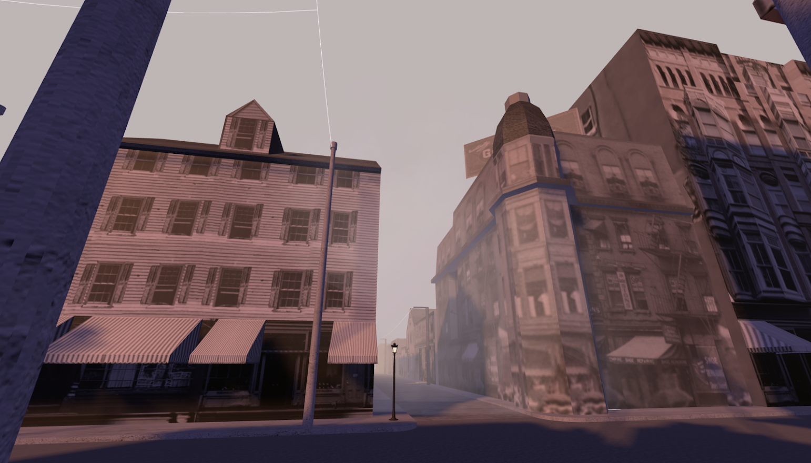
_Evening light in Mozilla Hubs._

Simple lighting effects can be added in the Mozilla Hubs editor, Spoke - like point lighting for lamps or light bulbs, or ambient light or sunlight.   

You can even animate falling snow, using a component called a particle emitter. (We'll talk more about this a little later.) Learn more about this technique here: [https://youtu.be/blFXb5b54pc](https://youtu.be/blFXb5b54pc)   

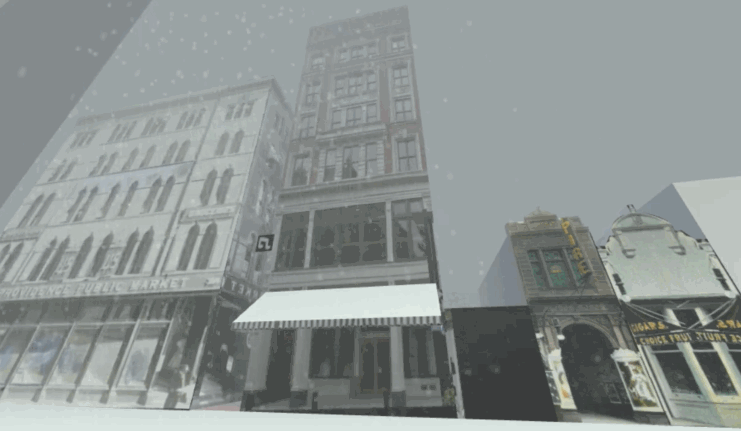
_Simulated snow falling in an early model of Providence's Chinatown, in the Mozilla Hubs platform._ 

But to create more complex kinds of atmospheric effects, you'll need to use a rendering program like Blender, which is free and open source.   

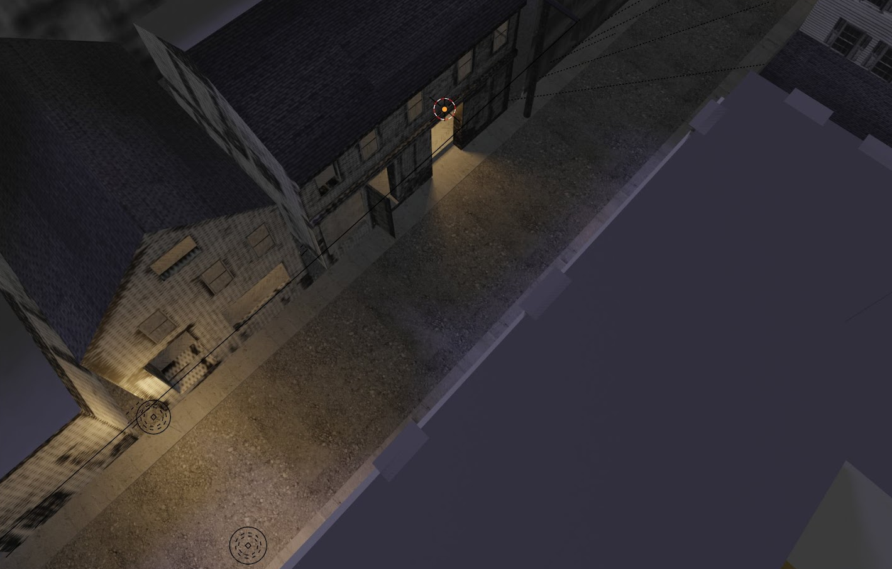
_Warm interior lights on a dimly lit evening street, in Blender._ 

For me, it's been a challenge to represent these spaces, because I have found few photographs of interiors, and even fewer of the people who lived and worked here. It doesn't make sense to fill them with fictional people, but neither has it felt right for them to be empty. One way I've sought to give a sense of peoples' presence has been to evoke a sense of warmth and comfort.   

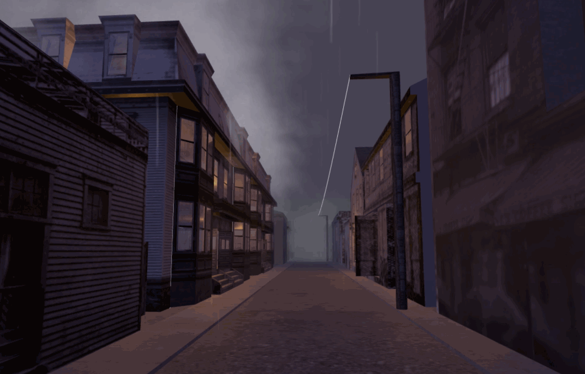
_Simulated rain and fog on Empire Street in a model of Providence's Chinatown._ 

Wet streets, rain and fog contrast with warm indoor lights to create a sense of shelter and enclosure, and visitors have remarked that they felt physically warmer upon coming inside out of the virtual rain.   

I was inspired by Alicia Renee Ball's 3D design work because of her powerful use of color, texture and composition, in addition to her interest in history, identity and place. Next, she'll show some of the ways she's incorporated more advanced atmospheric effects into a scene in Blender.  

You may find it helpful to watch the video version of the guide as Alicia goes through many of these steps in the Blender modeling program.  

(Link)  
  

## Alicia Renee Ball: New Echota  

Hi, my name is Alicia and I am going to demonstrate how Ito use Blender to worldbuild digital environments with dynamic presence.  

I have chosen to use a 3D model that I created through a technique known as photogrammetry for this portion of the guide. (If you would like to know more about this technique for making 3D models, see the notes in the written guide. Please visit this link for more information. [https://en.wikipedia.org/wiki/Photogrammetry](https://en.wikipedia.org/wiki/Photogrammetry))  

This model is a reconstruction of a big timber log cabin found at the historic site, New Echota. New Echota was the Capital of the Cherokee Nation in the early 19th century in the state of Georgia before forced removal by the U.S government. This area of Georgia is the home of the Koasati (Coushatta, Coosawattee, Coosa), Miccosukee, Yuchi and Cherokee Indigenous peoples.   

I have been studying the histories of Black people who lived under enslavement in this area, and who later would be known as Cherokee Freedmen following the Civil War. Their stories are part of the complex history of this place and this cabin shares some similarities with what their homes may have looked like. For me, this provides a partial glimpse of how they might have lived during this era, and is part of my journey to learn more about their lives.  

First, I will import my 3D model of the log cabin into Blender. As you see from my model it is already coveredskinned with a texture from the photogrammetry process.  

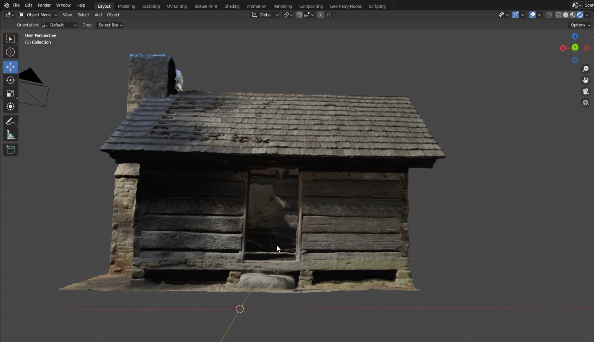
_The imported log cabin in Blender._ 

Then I am going to create a landscape for the log cabin to sit upon by adding a plane and utilizing it as my ground.  

I wanted to add depth and dimension to the ground plane instead of leaving it flat. This will help to create a dynamic sense of place that mimics the natural variety of landscape in the natural world.  

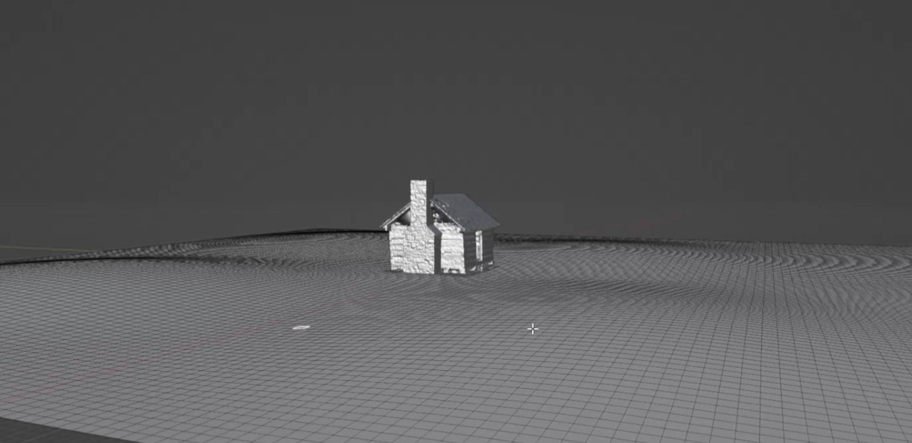
_Creating hilly ground around the cabin._ 

As I created height and depth on my surface plane, I made sure to examine it from all directions, tweaking it until it felt and looked just right.  

Next, to bring to life the digital environment I am building I will be adding in a skydome which will naturally light up our scene, followed by bringing in surface texture for our ground.  

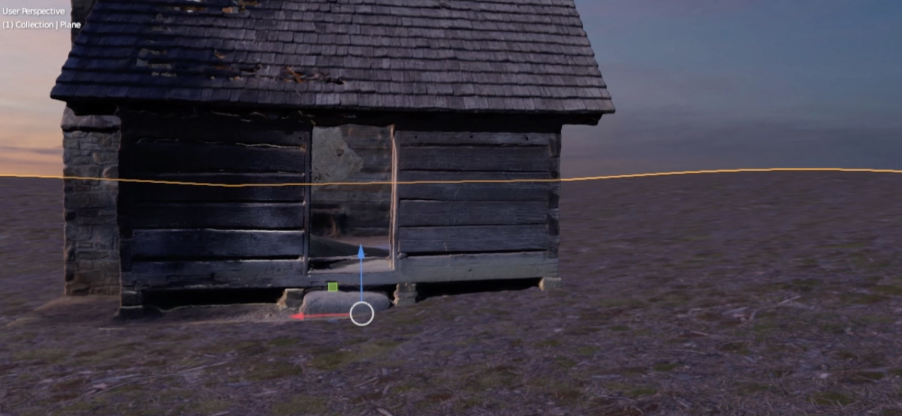
_Texturing the ground, and the "sunset" skydome in the background._ 

I am utilizing texture maps from a subscription based service called Poliigon. For your world building exploration you can find free textures and HDRIs to use through a simple google search. One site that offers free material textures is [polyhaven.com](https://polyhaven.com/).  

Although it was mid-day, clear and sunny when I first visited New Echota to capture footage of the log cabin for my reconstruction model, I want to create an environment that will evoke more emotion and a sublime sense of mystery. To do that, I have decided to set my scene at sunset.  

So, now I have imported my sunset HDRI into the scene as lighting and environment and picked a textured material that will best represent my memory of the ground at the historic site.  

From this point on I will be worldbuilding through what I describe as the speculative-imagine. How can I re-imagine and re-build parts of a real place that will evoke more emotion and a deeper connection to its histories.  

For me as an experimental artist and designer I like to play with mood. To help me build a more expansive world to experiment with mood through lighting, color and movement I have imported additional 3D models to better flesh out the scene.  

I am using 3D models I currently have access to from Poliigon, again for your world building you can find a plethora of free CAD resources online. Pick the models that will best speak to the world you are building or reconstructing.  

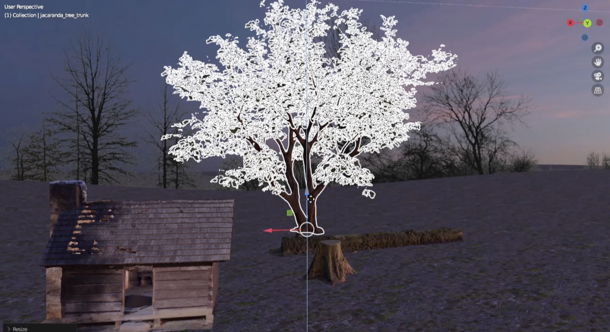
_Trees, stumps, and a log around the cabin._ 

So as you can see I imported a few tree stumps, a chopped log, and a living tree (Alive, Midlife and Death - can take this part out but a note for self). These items are in dialogue with one another, showcasing various stages of life, death and transition through the usage of natural resources to sustain a modern world. From living trees, to chopped tree stumps in transition to a log cabin.   

Creating a narrative, or working poetically/in a kind of spatial poetics in the digital environments you build also adds to the dynamism and emotion of place and space.   

To create more spatial depth in the scene, I have imported a horizontal image of barren trees with a transparent background to serve as our backdrop. This imagery of barren trees creates a sense of coldness in our built digital environment because it reminds us of the transition between seasons, from Summer to Fall and from Winter to Spring.  

_Tree backdrops behind the cabin._ 

Now, I want to explore how the use of moving light particles can add an ethereal, dreamy and otherworldly aspect to our environment. I will explore this concept by creating an animation of sauntering fireflies that will lightly dance, float and flutter throughout the scene.  

We will create these dancing fireflies by using a particle system in Blender. We will use our ground plane as the source that will generate tiny orbs of light, that we will animate through a physics system called Boids. Particle emitters can also be used to create rain or snow in a scene.   

(If you want to know more about how to create particle systems in Blender, see the notes in the written guide. /

see [https://docs.blender.org/manual/en/latest/physics/particles/emitter/physics/boids.html](https://docs.blender.org/manual/en/latest/physics/particles/emitter/physics/boids.html), and learn more about Boids at [https://en.wikipedia.org/wiki/Boids](https://en.wikipedia.org/wiki/Boids).)  

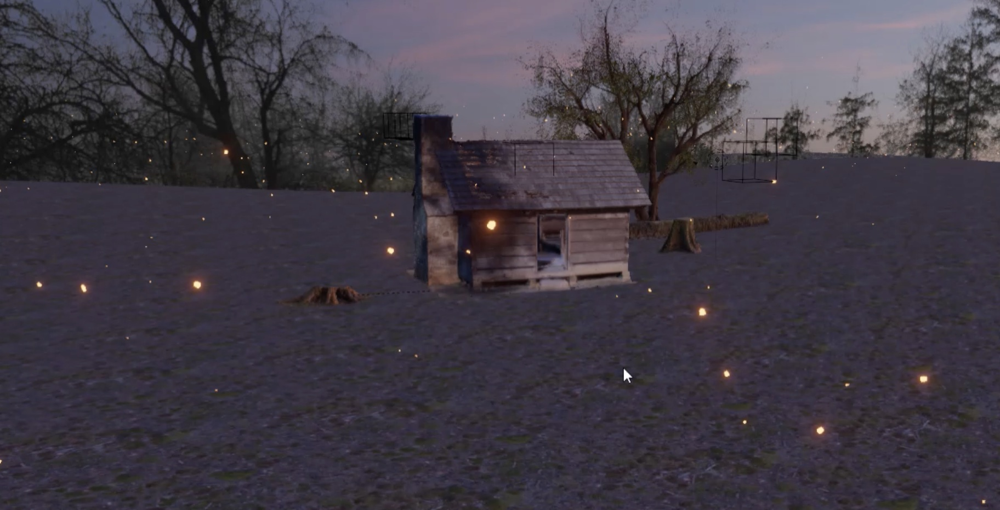
_Fireflies around the cabin._ 

We decided to use the Boids system to simulate the flight and flutter of the fireflies, whose blooming light will add further ambience to the scene.  

Finally, to turn up the drama, mood and mystery in this scene we will also explore importing atmospheric Fog into our environment, as previously mentioned earlier in the guide.  

(To learn about making fog, see the notes in the written guide. Here is a link to a simple guide of how to create volumetric Fog in Blender: [https://www.youtube.com/watch?v=MoggY\_6v5qQ](https://www.youtube.com/watch?v=MoggY_6v5qQ))  

Now I will tweak the settings to increase the density, depth, visibility and color of the fog to create varying moods for our speculative scene from New Echota.  

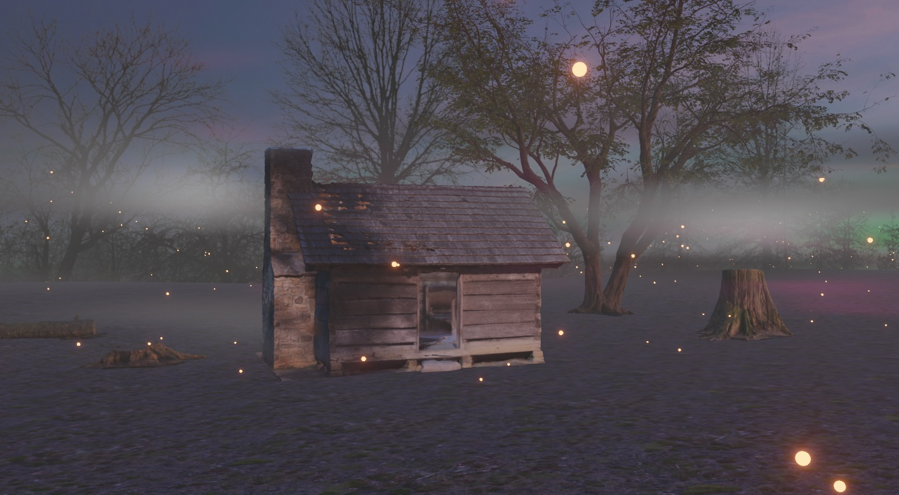
_Fog around the cabin._ 

In my art practice I enjoy infusing cosmic drama into the worlds I build, and I do this mostly through overlaying and merging colors. This creates a hazy environment of floating auras that coats our sky and changes the dynamic of the scene depending on the density level of the fog.  

Now I am going to play around with the camera angle until I land on a viewport of the scene that feels just right.  

Here is the end result of my speculative play and another way you can create emotional space in the worldbuilding development of your relational reconstructions.  

_Animated fireflies wandering around the cabin in the fog at dusk._ 

That concludes this portion of the Relational Reconstruction Toolkit. Next we'll discuss the crafting of historical soundscapes with artist Ann Chen.

[Next: Soundscapes >](/soundscapes/)
