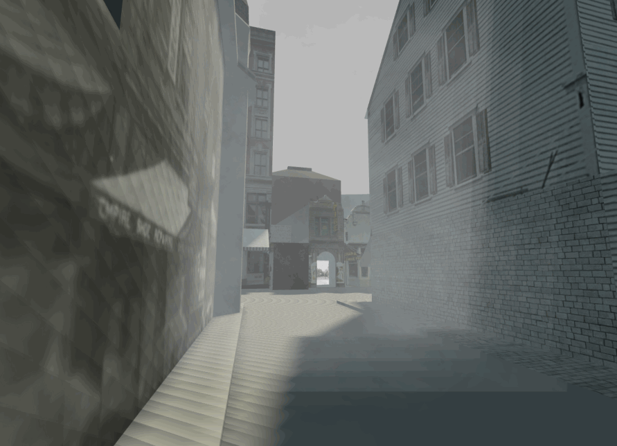

_Simulated fog, looking out from the entrance to Providence's Chinatown of 1914 in an early test model._

# Seeing Lost Enclaves: Introduction

This month marks the end of my first phase of work on the _Seeing Lost Enclaves_ project, and of the first phase of my residency at the Library of Congress as the 2023 Innovator in Residence, which I began this past October. It's been a rewarding three months, and a bit overwhelming, as I've begun to organize my work so that other people -- especially Asian Americans and descendants of erased communities -- can participate in using these techniques for creating virtual reconstructions of neighborhoods which were destroyed long ago. It's my hope that the act of crafting virtual re-creations can be a healing process for those with a personal connection to these spaces. 

Today I'm posting the latest complete draft of Part 1 of the _Relational Reconstruction Toolkit_. This is the first part of an evolving guide to _relational reconstruction_, based in the process I've used in [Seeing Providence Chinatown project](https://unterbahn.com/chinatown), about the neighborhood which existed on Empire Street in Providence, RI until December 1914. I'll be continuing to refine this, and to add guides and documentation of other parts of this process over the course of 2023, including topics such as reconstruction, modeling, soundscapes, and ambience.

Preparing this, along with a whirlwind first visit to the Library of Congress to do an initial search for materials and records, has taken up most of my time recently, and I've been doing fewer public events and workshops than I'd hoped. Visiting the Library of Congress was a powerful experience, and a reminder that there is pain in looking through these materials. Just trying to see people through the records left by racist newspapers, the violence itself, of course – but also the sense of mapping out a negative space in the archive: the space of silence. How many shelves, binders, directories, photographs said nothing at all. There were also moments of brightness; hand-scribbled notes in a yearbook, self-portraits, moments of quiet and joy and recognition.

_A fishmonger and customer. (cropped) [Specific Subject File filing series](https://www.loc.gov/item/2005675764/), Print and Photo Division, Library of Congress._

I remind myself that the goal of my work, of this idea of _relational reconstruction_, is, as I wrote months ago, to _"focus on the potential for a more multifaceted remembrance and correction, through relationships between the experiences partially represented in the archive, and today’s parallel experiences in minoritized groups. It acknowledges the limitations of the archive as a means of accessing erased moments, experiences, and spaces. In this approach, I seek to correct erasure, but through an imaginative, immersive, social, and creative approach, which encloses a gentle and nourishing space rather than enclosing an artifact of history in a diorama at a museum or on a plaque. This process restructures the archive as a set of selective clues, shaped by the active intent to obscure ancestral knowledges best expressed in ways least likely to be historically preserved – emotional tone, color, sound and smell, private moments and ephemera of personal relationships, hopes, aspirations, things unsaid."_

This is an intimidating goal. But what I've learned over the past year is not only that there are many others with a similar passion for understanding and connecting with the past in this way, but that sharing space, creativity, knowledge and ideas is nourishing -- as in the [workshops I led with Ann Chen](https://unterbahn.medium.com/community-memory-enclaves-960d7b7b4722) at CultureHub this fall. With this in mind, I'm looking forward to expanding this work -- through collaborations -- to see if these techniques can be useful in other places.

_Children with a parent or grandparent, with a marketplace in the distance behind them. (cropped) [Specific Subject File filing series](https://www.loc.gov/item/2005675764/), Print and Photo Division, Library of Congress._

I’m beginning to reach out to folks about – slowly – beginning a reconstruction project in another place. Last week I spent time looking for records in Truckee, CA, New Orleans, Deadwood, SD, and other places.

I’m interested in connecting with descendants of these communities, as well as with Asian American artists, historians, and community members interested in remembrance related to these places. Please see the link in my bio to let me know you’d like to connect, or just DM!

Thank you and please [take a look at the guide](#).

_An image from the [Mapping photos](../research/mapping.md) section of the Relational Reconstruction Toolkit guide._
