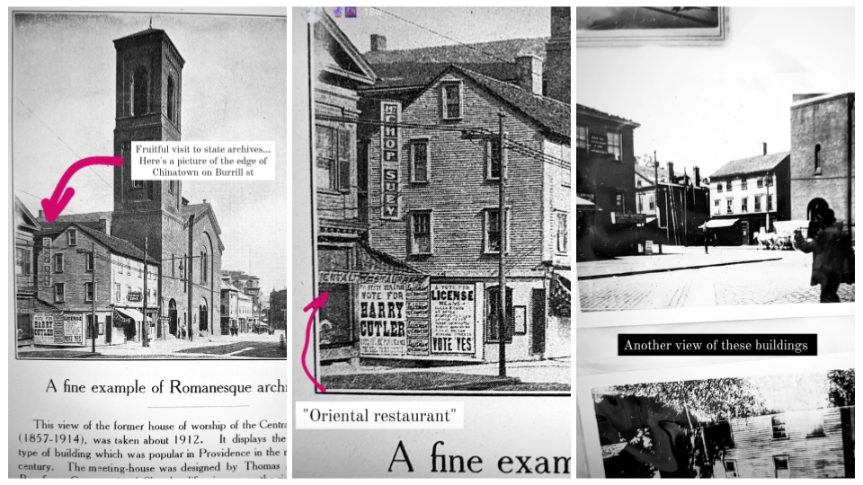

# Searching for images

For me, searching for images has required luck, creativity, and persistence. Erasure can often mean literal destruction of records, but it can also involve systematic lack of acknowledgement, recognition, or preservation of knowledge of a community. Searching for "Providence Chinatown" won't bring up many photos of what the neighborhood used to look like (although this project is itself beginning to change that). Many of the glimpses we can find of the neighborhood are incidental -- in the background of photographs of other things, like the image accompanying this article about Central Baptist Church:

"Looking in the background" is how I would describe my approach for _many_ of the images I was able to find of Providence's Chinatown. See how in the above image, the same building to the left side, which on careful inspection also has an awning labelled "ORIENTAL RESTAURANT," appears again in a second image from the RI State Archives, again in the background of a photograph of Central Baptist Church, with ladders leaning against it.

## Image search

In my experience, using Google or DuckDuckGo image search is worthwhile, but these search terms can work for online archives as well. You may have to skim through hundreds of photos. I prefer using DuckDuckGo's image search, since the full resolution image is directly linked from each result.

Starting with a phrase like "Providence Chinatown" or "historic Providence Chinatown" makes sense. You can begin to develop a list of keywords as well; mine included some of the following. Limit to a time range as well if possible.

* Chinatown
* Chinese
* Empire Street
* Walker Street
* Paine Street
* Shimbo Alley
* Swanson Gangway

The last few names are of streets that no longer exist, but were immediately around Chinatown in 1914, so they are excellent, and very unique keywords which I learned from old maps. (Also see the [Tracking photos](tracking.md) section for collecting and organizing keywords and street names.) In some cities, streets can be miles long. If there is a short street near your location, it's worth focusing on it. In New Orleans, Tulane Street is miles long, but the old name for Elk Place was South Basin Street, so "S. Basin Street" is a great search term -- and Basin Street overall is only a few blocks long. 

Pair the above keywords with your place name ("Providence") or "historic" or "archival"; you can also try things like "Overview of Truckee" for photos taken from a tall building or nearby hill.

## Maps and street names

To find maps, 

## Landmarks

Looking over your maps, find a landmark with the neighborhood in the background: 

http://images.truckeehistory.org/donationReport.php?donationNumber=16 (McGlashan Mansion, also known as the Crystal Palace, the Rocking Stone, the Rocking Stone Tower, also known as the Ice Cone, or Monster Icicle)

### Theaters

## Reverse image search

[Next: Mapping photos >](mapping.md)
