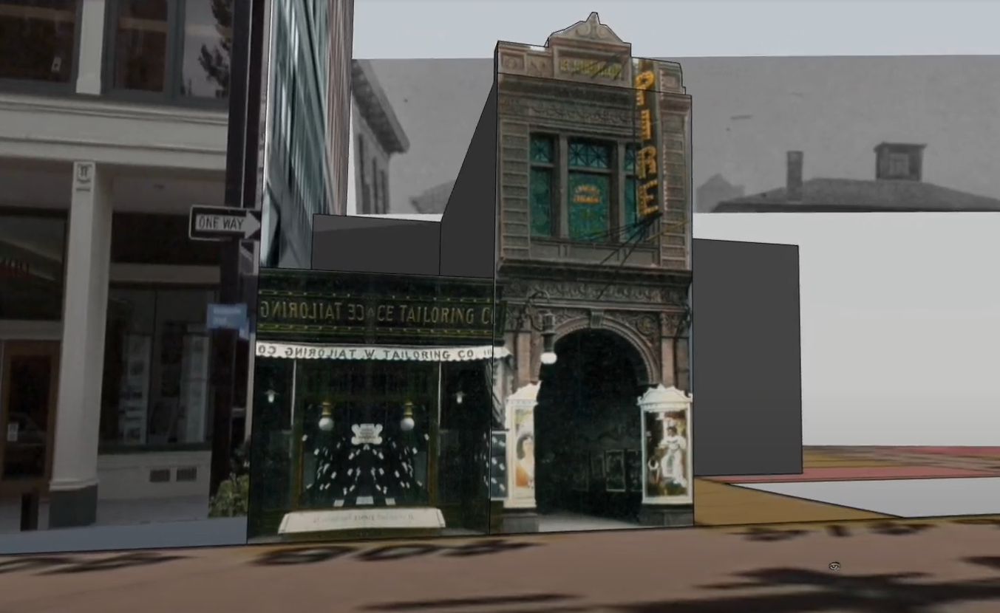

_A rough draft 3D model of the Empire Theater at the edge of Providence's Chinatown, crafted from period photographs and maps._

# Seeing Lost Enclaves
### Relational reconstructions of erased historic neighborhoods of color

Seeing Lost Enclaves is a project by [Jeffrey Yoo Warren](https://unterbahn.com) as part of the 2023 [Innovator in Residence Program](https://labs.loc.gov/about/opportunities/innovator-in-residence-program) at the [Library of Congress](https://www.loc.gov/).

_This is a draft. The final version will be published in September 2023._ This guide will continue to grow and change as the project emerges. 

Part 1 is the first part of an evolving guide to _relational reconstruction_, a set of practices for creating an immersive (virtual, 3D) reconstruction of an erased neighborhood, such as the one I have begun to craft in the [Seeing Providence Chinatown project](https://unterbahn.com/chinatown) (see below), about the neighborhood which existed on Empire Street in Providence, RI until December 1914. Guides and documentation of subsequent phases of this work will be posted over the course of 2023, and will include topics such as reconstruction, modeling, soundscapes, ambience. 

As I dive deeper into this work, I hope to share the techniques I've learned and developed, both in this guide and through public workshops over the coming months. I especially hope to work together with fellow Asian Americans who share my interest in unearthing early histories and stories of erased communities across the country -- and with descendants of these communities. Though Chinatowns are for me a starting point, due to my work in Providence's Chinatown, I am also interested in the histories of other erased communities of color, and hope to learn more about these histories over the course of the project. Please [reach out](contact.md) if you are interested in sharing or contributing.

## Contents

<!-- * [Introductory blog post](blog/01-introduction.md) -->

* [Introductory blog post](https://blogs.loc.gov/thesignal/2023/01/introducing-seeing-lost-enclaves-with-innovator-in-residence-jeffrey-yoo-warren/)
* [Part 1: Research](research/)
* [Part 2: Modeling](modeling/)
* [Part 3: Atmosphere](atmosphere/) (with [Alicia Renee Ball](https://aliciareneeball.com/))
* [Part 4: Soundscapes](soundscapes/) (with [Ann Chen](https://annhchen.com/))
* [Related work / inspirations](inspirations.md)
* [Frequently Asked Questions](faq.md)

## What is relational reconstruction?

_Relational reconstruction_ focuses on the potential for a more multifaceted remembrance and correction, through relationships between the experiences partially represented in the archive, and today’s parallel experiences in minoritized groups. It acknowledges the limitations of the archive as a means of accessing erased moments, experiences, and spaces. In this approach, I seek to correct erasure, but through an imaginative, immersive, social, and creative approach, which encloses a gentle and nourishing space rather than enclosing an artifact of history in a diorama at a museum or on a plaque. This process restructures the archive as a set of selective clues, shaped by the active intent to obscure ancestral knowledges best expressed in ways least likely to be historically preserved – emotional tone, color, sound and smell, private moments and ephemera of personal relationships, hopes, aspirations, things unsaid. For more about who has shaped my thinking around these ideas, see my [Inspirations page here](inspirations.md).

_An early walkthrough of a virtual reconstruction of Providence's Chinatown in 1914._

## Seeing Providence Chinatown

This research guide comes out of initial work in [Seeing Providence Chinatown](https://unterbahn.com/chinatown), inspired by the excellent [RI Chinese History Project](https://richinesehistory.com/), by Angela Yuanuan Feng, Julieanne Fontana, John Eng-Wong, and others at Brown University's [Center for Public Humanities and Cultural Heritage](https://www.brown.edu/academics/public-humanities/home). 

In thinking about my approach in that project, I wrote:

> I hope to produce a more immersive and contextually complete record by way of a spatial and sensory reconstruction, which will enable audiences to experience in a richer and more personal way what it would have felt like to stand in the heart of Providence's Chinatown and other erased enclaves of color. Our histories include traumas – my ancestors were not allowed into the US until 1965, and the early history of Asian Americans in Providence was also fraught with exoticization – like Chinese performer Afong Moy’s 1835 appearance as a curiosity in the Providence Museum. These histories are over-represented in the archive.

> By contrast, my goal is to use the process of reconstruction as one of healing and of belonging, and as a reclaiming and re-contextualizing of the archive and its meanings for our futures, inspired by the speculative futurity projects of contemporary Black artists and Saidiya Hartman's concept of _critical fabulation_. My practice engages peoples’ creative and collaborative abilities, building tools and spaces which support and inspire creative practices, and the Relational Reconstruction Toolkit focuses on the creative possibilities of what it could have felt like –as an Asian American person – to walk down the street and experience a sense of belonging at that moment in history.

_Seeing Providence Chinatown_ received early support from the [Rhode Island Council for the Humanities](https://rihumanities.org/), [Movement Education Outdoors](https://meoutdoorsri.com/), [AS220](https://as220.org), and the City of Providence's [Department of Arts, Culture, and Tourism](https://artculturetourism.com/).
