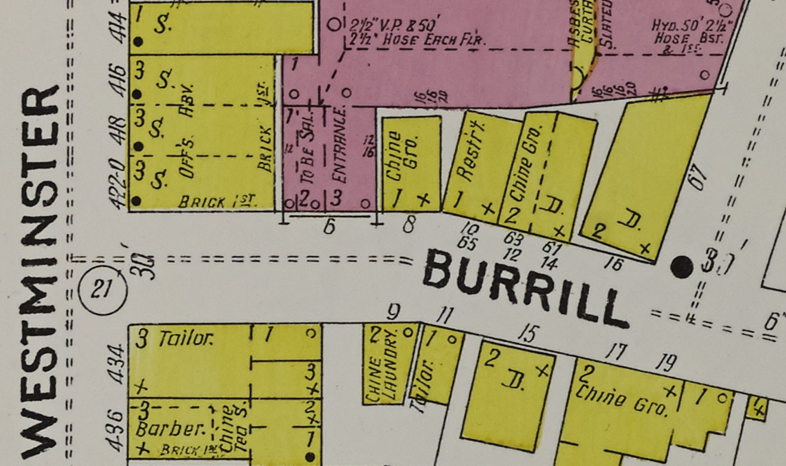

# Seeing Lost Enclaves
### Relational reconstructions of erased historic neighborhoods of color

_This is a draft. The final version will be published in September 2023._

## Part 2: Modeling

This part of the Relational Reconstruction guide will focus on how to begin 3D modeling using archival records.   

In my work virtually reconstructing Providence Chinatown, I've shared videos like this one, which was the first moment I had enough buildings rebuilt that it really felt like a neighborhood.   

_An early walkthrough of a virtual reconstruction of Providence's Chinatown in 1914._

In the first part of the guide, where we looked through archival records to find photographs and other clues to work with, I discussed some of the painful aspects of learning about histories of trauma and harm, and of navigating the way these old stories were told. For me, this next part of the process was an opportunity to heal. The act of reconstruction can be an act of repair -- of stitching back together these fleeting glimpses and creating a space of care. 

## Accuracy and intent

Because of the partial nature of the source materials we must work with, and the histories of erasure these neighborhoods have endured, we will be exercising creativity in our reconstruction process. One of my main inspirations in this has been Saidiya Hartman, whose "critical fabulation" proposes a speculative approach to writing into the gaps and against the archives. For more, see [Inspirations](inspirations). 
  

Let's look at some of the techniques I've used. But keep in mind, the best way to learn is together, and I'll be hosting workshops on these techniques in the spring and summer of 2023\.   

The modeling process has three main steps:  

1. Tracing building footprints
2. Creating surfaces from photos
3. Applying surfaces to the model  
  

_An 1899 Sanborn map of Providence's Chinatown, showing several Chinese American businesses. [Library of Congress](https://www.loc.gov/item/sanborn08099_003/), (image 18)._ 

## Maps & scale  

Often, as shown in the research portion of the guide, I use maps to understand a space at a moment in time. If you have a map showing buildings you're interested in, and you have a pretty flat area (like Providence's Chinatown), you can import the map into a 3D program to begin modeling on it. But first you'll need to get the scale right.   
  
Many maps, including Sanborn insurance maps at the Library of Congress, have a scale reference. So you can start by tracing it, and noting how long your tracing is. This step isn't essential, but it's helpful to work at 1:1 scale as early as possible.  

Here, the scale reference as I first roughly placed the map was showing 150 feet, but measuring it in SketchUp, it was only 125 feet long in the scale of the model. So 150/125 = 1.2x. I then scaled the map up by a proportion of 1.2x. To check my work, I re-measured, and saw that the 150 foot scale bar was now correct: 150 feet long in the virtual environment.  

_Tracing a scale bar in a Sanborn insurance map in the SketchUp modeling program._ 

If you don't have such a scale reference, you could try measuring a big building in the real world. Or you could try measuring streets... but think about how streets may have widened or narrowed over the years, and how sidewalks and curbs change. So when I do this, I do two things to minimize errors -- I use as big a distance as possible, so the small errors even out, and I measure from the middle of the street instead of from the curb, as precisely as I can.  

This is a pretty obscure place to begin, but it gets more interesting from here out.   

## Terrain  

Some neighborhoods aren't on flat ground, of course. I won't go in depth on terrain here, as it's complex. But if your site is on a hillside, or for example a river valley, you can approximate the terrain by tracing contours, then "draping" a surface over them. You could also try to find sources of real-world elevation, maybe at a city or state mapping or GIS office, but importing them could be complex. It may be better to create your own through draping, as the model will be simpler as a result.   

_In this map I roughly traced the contours drawn on the map, then raised them to create rough contours._ 

Some programs like SketchUp also have an "Autofold" feature in the move tool which folds the surface as you move it, which can be simpler than draping:  

_SketchUp's Autofold feature for making simple terrain._ 

More rural Chinatowns and ethnic enclaves were sometimes on steep ground, which was harder to build on and less accessible. But this also enabled them to be more protected and enclosed.   
  
  
## Tracing a footprint & blocking out buildings 

Once you have your map scaled and oriented, you can trace the footprints of buildings on its surface, and pull them up from the map to create a very rough model of the neighborhood. If you know building heights, you can adjust those as well. Repeat this for as many buildings as you can -- if not all are shown, you can fill in more later.   

_Tracing the outline of a building from a Sanborn insurance map, and pulling it up from the surface to form a rough box, in the SketchUp modeling program._ 

If you're working on contoured terrain like a hillside, I recommend using a flat map to model the buildings, then moving them back over to the hilly model afterwards.  

_A group of roughly modeled buildings on the surface of a Sanborn insurance map of Providence, RI._ 

Now, although things are probably strange colors, you have a very rough idea of how different buildings were organized in 3D space... enough in some cases to try zooming in, adjusting your "height" and walking in the space. It might help to paint all the buildings grey, and to try turning on shadows. Try comparing different angles to photographs of the place, to see if you can see things match up.  

At this point you may want to begin making your buildings into separate groups within the model. It will help you organize your work and will be more difficult to do later. It can also be tempting to delete your map now that you're done with it, but I recommend moving it down below your model in case you need it for reference later, because it'll be difficult to re-position.   

## Creating surfaces  

Now I'll show how we can take old photographs like these and map them onto the buildings we've made.   
  

_A collection of images of a building on Burrill Street Chinatown in Providence, ca. 1900-1914._ 

I collected these over many months, but now I feel like I have enough to work on this building. For more on finding images, see the research portion of this guide.  

We choose as front-facing a photo as we can, at the highest resolution available, and trace the edge of the building surface. Here I'm just doing the front facade, and I'll do the side separately. I chose a complete photo of the facade to start with, and I'll add other partial photos at better resolutions on top of it.   

_Cropping and transforming the facade of a building in Burrill Street Chinatown, Providence._

After tracing the facade and copying it to a new layer, I'll use the free transform tool or the perspective distort tool to flatten the facade -- as if we were facing it straight on -- if it's a square facade, the top and bottom edges will be perfectly horizontal, and the left and right edges perfectly vertical. You can use guide lines to ensure the image is square:  

_Guide lines can be dragged from the ruler bars at the left and top of the window in many image editing programs._ 

If you have a variety of photos of a building, many of them partial, it can help to diagram the building's surfaces out. You may need to combine multiple photos to get a complete facade.   

_A diagram of each face of the building on Burrill Street and the corresponding photos showing that surface, if such a photo exists._ 

For this building in Providence's Burrill Street Chinatown, near Empire Street, I originally thought I had very few photos to work with. But looking carefully through what I'd found, I was able to identify enough photographs to see 3 out of 4 sides of the corner building.  

If a facade is symmetrical, flipping or mirroring a photo can help you complete a surface. Although the mirroring is obvious when you look at it, it's an honest way to communicate how you've used the photos, and doesn't distractingly interrupt the scene as a blank area might.   

_The Empire Theater and Providence Tailoring Co, showing how the tailor shop's storefront has been mirrored for completion._ 

Sometimes, if a building has a lot of repeated elements, like windows, it can be worthwhile to use one high resolution photo to "stitch together" a much higher resolution image of the whole facade. This can start to become more speculative, however, if there are details like the staircases and balconies in this example photo, where you aren't completely sure of the original appearance. If you're comfortable making an educated guess, that's fine, but it's helpful to keep careful note of what you are basing on a clear photograph versus what you're speculating about. In my work, I feel it's important to have a certain level of completeness to feel more "real," especially for important buildings in the history of a neighborhood -- but it's a judgment call.   

_A gif of stitching images together to complete a facade with repeating elements._ 

Finally, save your work as a JPG file and open your 3D model.  
  

## Applying surfaces  

Now, if you have rough building forms ready to apply your facade to, you can do so. Resizing it to match the edge which touches the ground, for scale. Then try increasing the building height to match.  

_Stretching a facade onto a building form in SketchUp._ 

Your perspective-corrected facade may not be the correct height to width ratio -- that can be hard to recover precisely -- so you may want to rotate your view to match a reference photo, and try matching the building height to that photo.   

_The partially built 3D model of a Burrill St. building between two reference photos from similar angles._ 

Now you can repeat the last step with other facades, if you have them, and begin to adjust the building form to better match the facades.   

_Adding roof gables in SketchUp, using the push/pull tool._ 

Did the building have a gabled roof? Did it have insets, or overhangs, or columns?  

This is a powerful step for me, where we start to get a feeling for the neighborhood through its textures and visual language. Sometimes we can see people walking down the street or paused on a sidewalk.  

It's at this point that I sometimes feel that I'm crafting a space "for someone" -- smoothing out the kinks in the sidewalks, leaving space for gardens or private nooks. Sweeping and tidying up their space, which has long sat gathering dust.   

_The neighborhood model beginning to take shape, with some buildings partially complete, others bare._ 

You can prepare more facade images, re-use portions, or model things like archways, but try to let the images you apply to the model do most of the work of adding detail, because you want a simple building model, and it can be hard to make realistic 3D details that do better than the textures you've already applied.  

I did a lot of image stitching to get a clearer picture of the front of this building. But you don't have to do this; for other buildings I intentionally left the newsprint texture to show where the image came from.   

_Stitching together a facade from pieces taken from other sides of the same building._ 

For more important buildings, you can cut out windows, add steps and multiple floors. But these kinds of details can wait -- they aren't what makes or breaks a model. Even a simple model can be a very powerful reconstruction, and the Atmosphere portion of this guide will show how to make the most of your reconstruction through lighting and ambient effects.   

## Textures  

At a certain point, you may want to look for free to use textures to supplement your model. These could be cropped from old photos from the period, or taken from texture libraries with free to use images. Some common types of textures you may need might include:  

- paved or unpaved streets
- sidewalks, cement/concrete
- wood siding
- brick, worn or distressed brick
- doors, windows, shutters in various styles
- roofing: shingles, tiles
- assorted masonry, stone walls and ledges or details
- wood fences or walls  

You can also look for architectural elements in some of the Library of Congress collections. See for example this image of brick and patio surfaces:   

_A photograph looking downward onto the roof garden of the Lenox Hill Settlement in NYC, between ca. 1915 and ca. 1920. https://www.loc.gov/pictures/item/2014702218/_

Some places to search include:  

- The Genthe collection: [https://www.loc.gov/pictures/collection/agc/](https://www.loc.gov/pictures/collection/agc/)
- The Historic American Buildings Survey/Historic American Engineering Record/Historic American Landscapes Survey: [https://www.loc.gov/pictures/collection/hh/](https://www.loc.gov/pictures/collection/hh/)
- Carnegie Survey of the Architecture of the South: [https://www.loc.gov/pictures/search/?st=grid&co=csas](https://www.loc.gov/pictures/search/?st=grid&co=csas)  

There are techniques for cropping and distorting parts of these images to create textures, which I will be sharing more about later, as well as advanced techniques for generating textures with roughness and reflectivity, as well as surfaces which appear wet.   

Finally, there are many free to use textures available online, typically in the Physically Based Rendering (PBR) format. Here are a few places to look for these:  

- [https://gist.github.com/mauricesvay/1330cc530f6ab2ef33eb6a5ea56ef5bd](https://gist.github.com/mauricesvay/1330cc530f6ab2ef33eb6a5ea56ef5bd) 
- [https://ambientcg.com](https://ambientcg.com)   

Free to use PBR textures available at https://ambientcg.com.  

While these can be very helpful sources for free-to-use textures from a similar time period, I have begun to think about the particular meanings of textures for communities of color, and the ways in which we might look to related histories in sourcing such materials as walls, floors, roofs, and more. If we can't find high resolution photographs of a cabin in Portland, Oregon's Chinese Vegetable Gardens, might we look to other Chinese American communities from that period to source textures which would be not only historically appropriate, but culturally meaningful in their origins? While the language around textures often implies that they are completely generic, re-usable, and universal, might we challenge those ideas by caring about how such textures carry meanings, in the way a familiar carpet or wallpaper from our childhood carries meaning for us today? I hope to share more ideas and methods on this theme in the coming months.  

## Backdrops  

Zooming out a bit, you can see how things start to break down at the edges of our model - we get glimpses of the "edge of the world" or we notice where the "sky" meets the "ground." Our reconstructed neighborhood has to end somewhere, but I've used existing archival street photos as "backdrops" to give a sense of continuation that can be based on what was historically there.   

_Open space visible between buildings in a virtual model of Providence's Chinatown in 1914._  

_A backdrop roughly aligned with the street shows the view one would have had from that perspective._ 

In Providence's Chinatown, there were far more photos of neighboring streets than of Chinatown itself, so I have lots of options for photos showing distant, receding buildings in most directions. Another convention is to use "fog" to make distant items more faded. I prefer to blur background images, to simulate a lens blur effect, since we are more interested in continuity and a sense of place than in the specific details of the image. This can also be effective for creating distant rooftops and buildings in the distance, as in this picture from a third floor window in Providence Chinatown.  

_Blurred and unblurred backdrops showing rooftops behind buildings._ 

The sky itself is a kind of backdrop as well. Although there are a surprising number of good photos of the sky from the era of black and white photography, these can be difficult to use as a 360 degree "dome" in a way that looks convincing. There are online collections of free to use 360 sky panoramas, sometimes called skyboxes or HDRIs. Or you could take your own photograph of the kind of sky you want. Any of these can be imported into our final virtual environment and mapped onto a sphere, which we wrap around our final model.   

_A "skydome" hemispherical projection of a starry sky around a model, in Mozilla Hubs._ 

## Streets, yards, details

Once your buildings and backdrops are in place, there are likely still a lot of surfaces in your model which remain bare, and it may help to add textures to things like yards, alleys, and sidewalks. You could also add vegetation or things like benches, street lights, crates, or other things which help to flesh out the scene a bit. Plants and trees can be especially tough, because they have such complex shapes.   

## Conclusion  

You don't need to model the whole city; sometimes even a couple buildings can be enough to create a compelling feeling of a place. In a later section, I'll show how lighting and atmospheric effects, as well as materials and textures, can add to the feeling of a place, and create emotional tone. It's worthwhile to try this even with a partial model, to get a better feeling for the space, for example, at night.   

_A virtual model of Burrill Street Chinatown in Providence, RI, c1900._ 

Above all, I've tried to focus on the feeling of a particular place or moment, rather than trying to create a "complete" or highly detailed model. Where might residents of this place have sat and watched people walk by? Taken a nap, or sat back and daydreamed?   

That wraps up this part of the Relational Reconstruction Toolkit. In the next section, you'll learn how to add emotional tone to your scene through lighting and atmospheric effects.

[Next: Atmosphere >](/atmosphere/)
