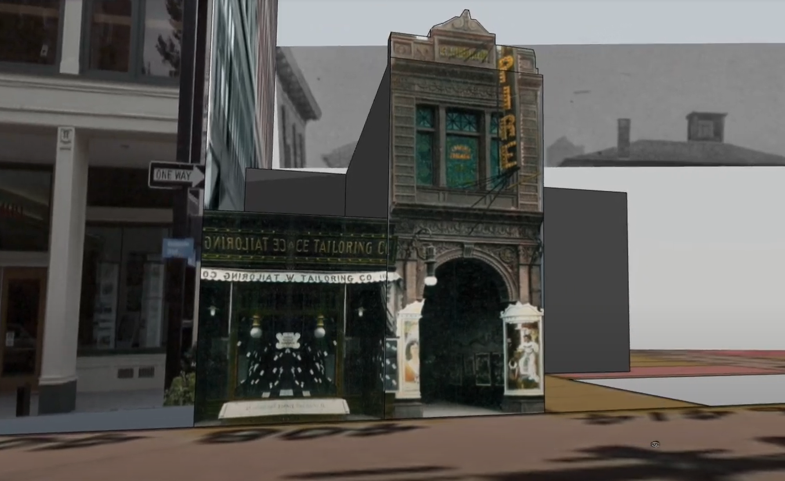

# Relational Reconstruction

_Relational reconstruction_ focuses on the potential for a more multifaceted remembrance and correction, through relationships between the experiences partially represented in the archive, and today’s parallel experiences in minoritized groups. It acknowledges the limitations of the archive as a means of accessing erased moments, experiences, and spaces. In this approach, I seek to correct erasure, but through an imaginative, immersive, social, and creative approach, which encloses a gentle and nourishing space rather than enclosing an artifact of history in a diorama at a museum or on a plaque. This process restructures the archive as a set of selective clues, shaped by the active intent to obscure ancestral knowledges best expressed in ways least likely to be historically preserved – emotional tone, color, sound and smell, private moments and ephemera of personal relationships, hopes, aspirations, things unsaid.
