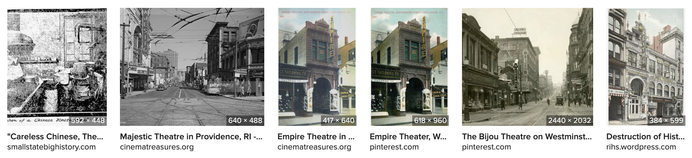

# Searching for images

Searching through archival images can be traumatic and emotional. Especially when searching in historically White institutions, photos and especially drawings depicting communities and individual people of color are often dehumanizing or even violent. What's more, erasure can often mean literal destruction of records, but it can also involve systematic lack of acknowledgement, recognition, or preservation of knowledge of a community. Photographs can also preserve and represent powerful moments of humanity, of daily life, of family and even of our ancestors, and sometimes I found that a photograph of something apparently mundane, but familiar, like a kitchen implement or a piece of clothing, held my attention and provided some kind of hard-to-describe connection. Whether photographs bring heavy or warm feelings, allow yourself the time to process.

For me, finding images has required luck, creativity, and persistence. Searching for "Providence Chinatown" won't bring up many photos of what the neighborhood used to look like (although this project is itself beginning to change that). Many of the glimpses we can find of the neighborhood are incidental -- in the background of photographs of other things, like the image accompanying this article about Central Baptist Church:

_Images of Central Baptist Church from the [Rhode Island State Archives](https://www.sos.ri.gov/divisions/state-archives)_

"Looking in the background" is how I would describe my approach for _many_ of the images I was able to find of Providence's Chinatown. See how in the above image, the same building to the left side, which on careful inspection also has an awning labelled "ORIENTAL RESTAURANT," appears again in a second image from the RI State Archives, again in the background of a photograph of Central Baptist Church, with ladders leaning against it.

## Online image search

In my experience, using Google or DuckDuckGo image search is worthwhile, but these search terms can work for online archives as well. You may have to skim through hundreds of photos. I prefer using DuckDuckGo's image search, since the full resolution image is directly linked from each result. These search terms can also work in the Library of Congress's various search systems, such as the [Prints and Photos Division search](https://www.loc.gov/photos/). See _Starting points_ on the [Bibliography page](bibliography.md) for more places to search for imagery. 

Starting with a phrase like "Providence Chinatown" or "historic Providence Chinatown" makes sense. You can begin to develop a list of keywords as well; mine included some of the following. Limit to a time range as well if possible.

* Chinatown
* Chinese
* Empire Street
* Walker Street (old name for Empire Street)
* Shimbo Alley
* Paine Street (old name for Shimbo Alley)
* Swanson Gangway

The last few names are of small streets and alleys that no longer exist, but were immediately around Chinatown in 1914, so they are excellent, very unique keywords which I learned from old maps. (Also see the [Tracking photos](tracking.md) section for collecting and organizing keywords and street names.) In some cities, streets can be miles long. 

If there is a short street near your location, it's worth focusing on it. In New Orleans, Tulane Street is miles long, but the old name for Elk Place was South Basin Street, so "S. Basin Street" is a great search term -- and Basin Street overall is only a few blocks long. 

Pair the above keywords with your place name ("Providence") or "historic" or "archival"; you can also try things like "Overview of Truckee" for photos taken from a tall building or nearby hill.

_"Deadwood, [S.D.] from Mrs. Livingston's Hill" by Grabill, John C. H, between 1887-92. The area of Chinatown can be seen in the distance. See [Mapping photos](/research/mapping.md) for more on this image._

## Maps

Sanborn maps (see _Starting points_ in the [bibliography](bibliography.md)) were created by the Sanborn Insuance Company every few years for most cities above a certain size in the US since the late 1800s. These can provide detailed context for photographs and other records, as well as addresses, details on entryways and even staircases or roofing. Searching maps before and after the period you're researching can often offer additional clues to when buildings were built or how they were modified, and when street names changed. 

_An 1899 Sanborn map of Providence's Chinatown, showing several Chinese American businesses._

Some local records may contain property maps and other detailed maps at a similar level of detail to Sanborn maps, and are worth searching for at local libraries, archives, and City Hall records. See [Mapping photos](/research/mapping.md) for more on how to use this kind of map.

## Landmarks

One way to search for images is to identify a uniquely named nearby landmark to search for, in the hopes that the neighborhood you're searching for appears in the background. Like Central Baptist Church at the start of this section, photographs of the landmark from different angles and eras can include precious glimpses of a community.

Looking over your maps and photographs, find a landmark with the neighborhood in the background, and research what names it has had over the years. In Truckee, a distinctive tower near the site of Chinatown was part of McGlashan Mansion, the home of a noted racist community leader. (See _Buildings and landmarks_ in [Tracking photos](tracking.md)). Although ultimately I found that the tower was built after the nearby Chinatown was destroyed, learning the various nicknames the tower had over the years ("the Crystal Palace, the Rocking Stone, the Rocking Stone Tower, also known as the Ice Cone, or Monster Icicle," [Truckee-Donner Historical Society](http://images.truckeehistory.org/donationReport.php?donationNumber=16)) helped to widen my search of photos of the area, and later find a photo of the site before the tower was built, possibly showing a glimpse of Truckee's Chinatown district.

Building out a timeline for nearby landmarks can also help with this kind of search; see _Build a rough timeline_ in the [Tracking photos](tracking.md) section.

_The Modern Theater in 1916, showing the street corner just outside of Chinatown following its destruction in 1914, from [CinemaTreasures.org](http://cinematreasures.org/theaters/6596/photos/336594), dated from the posters of what was playing at the time._

### Theaters

The website [CinemaTreasures.org](https://cinematreasures.org) is a surprisingly rich resource for tracking the history of old theaters, from construction dates to name changes to photographs and even dating images based on the posters of shows currently playing. Check the Photos and Comments tabs of a page to see user contributions.

_"The great Hub-and-Hub race at Deadwood, Dak., July 4, 1888, between the only two Chinese hose teams in the United States" by John C. H. Grabill. [Library of Congress](https://www.loc.gov/item/99613960/)_

### Events & celebrations

Regular events and celebrations nearby can be useful search terms; examples that helped in Providence Chinatown include Chinese New Year, while in Deadwood, South Dakota, Chinese Americans participated in town parades and competitions like the Hub-and-Hub race on July 4th, 1888, and are featured in several [photographs of the event](https://www.loc.gov/item/99613961/). 

## Reverse image search

An interesting and powerful technique for finding additional images of a neighborhood is to use reverse image search on photographs of buildings you already have, even for the wrong time period. If you can identify a really visually unique landmark, especially a building with a unique silhouette, reverse image search can sometimes bring up other photographs of the same building. It can also sometimes surface better resolution versions of a photograph, or wider crops showing more detail around the edges, or from different time periods. 

I'll post more on this technique soon.

<!-- include reverse search image later -->

## Newspaper archives

Newspapers were, for me, the heaviest part of the research process, due to the constant use of racist language, the casual lack of respect care or for Asian Americans, and the accounts of police harassment, violence, and erasure which pervades coverage. Even present-day coverage of communities of color is disturbing, whether of historic events or not. But there was a lot of information in these archives, and I felt a responsibility to sift through them to find what I could. This sometimes meant searching every article of every issue of a newspaper for days or weeks following a major event (violence, celebrations, world events) to see what I could find. 

Uniquely, many online newspaper archives include full text search, meaning that you can search within the text of the articles for keywords, just like those we used for photo searches. This also means that, unfortunately, searching for slurs and outdated or innacurate terms can sometimes be a productive, if hurtful, search technique. Please exercise care for yourself and your community if you choose to use these. 

### Content warning:

_The following list includes commonly occurring racist terms and terms used incorrectly due to racist beliefs and practices, for the purpose of archival search._

Click to view racist search terms

Chinamen/Chinaman
 
Coolie
 
Oriental
 
Asiatic
 
Mongolian (for Chinese people)

 

Many newspapers can be found through the [US Newspaper Directory](https://chroniclingamerica.loc.gov/search/titles/), a search service of the [Chronicling America](https://chroniclingamerica.loc.gov/) online collection and search engine at the Library of Congress. The US Newspaper Directory has a very comprehensive list of all newspapers in the US (with notable exceptions, see below), but not all of them are available for full text search in the Chronicling America search engine. Use the US Newspaper Directory to identify which newspapers exist, and Chronicling America to search within those that have been scanned in. The US Newspaper Directory will also link out to other libraries which have those newspapers, as well as to WorldCat.org for additional cross-library listings. See the [bibliography](bibliography.md) for more.

_A variety of scanned pages from Providence, RI newspapers, including some with racist depictions and designs._

However, neither Chronicling America nor the US Newspaper Directory has a comprehensive listing of non-English-language newspapers, nor is it currently possible to search in non-Latin characters with these tools. It is possible to search by "ethnicity press," and [57 newspapers](https://chroniclingamerica.loc.gov/search/titles/results/?state=&county=&city=&year1=1690&year2=1920&terms=&frequency=&language=&ethnicity=Chinese&labor=&material_type=&lccn=&rows=50) are returned when using this to search for "Chinese" before 1920, and [19 for "Korean,"](https://chroniclingamerica.loc.gov/search/titles/results/?state=&county=&city=&year1=1690&year2=1920&terms=&frequency=&language=&ethnicity=Korean&labor=&material_type=&lccn=&rows=50) although only a few of these definitely predate 1920. 

I've been very interested in how early Chinese American and Asian American newspapers covered lives of people in their own communities, and have found a number of resources for in-community newspapers, which you can find in the [bibliography](bibliography.md). These come with their own challenges of access, language, and preservation, but I hope to expand this area of archival search in the coming year.

<!-- could show image of 1855 Chinese language newspaper -->

## Physical archives

Searching physical archives is a larger topic than I can get into here, and varies widely depending on the archive. But many local and community archives are not available online. Many are open to the public; the City of Providence archives require no appointment, and contain many original photographs, as well as police records containing mugshots, property records, business directories, and marriage and court records. These can all be important parts of piecing together histories, although they focus on a narrow slice of peoples' lives. Cross-referencing peoples' names, ages, and addresses from court, marriage, deed and police records can be painstaking but revealing.

The Library of Congress has many records which are not available online, including photographs, maps, business directories, and of course, books. The [AAPI Community Collection](https://guides.loc.gov/asian-american-pacific-islander/aapi-collection), for example, is publicly available but must be requested several days in advance and only box by box; librarians in the [Asian Division](https://www.loc.gov/research-centers/asian/about-this-research-center/?loclr=blognbf) can help locate specific items within, and I took careful notes on its contents myself; it contains books, manuscripts, personal records, yearbooks, maps, and a wide variety of other items. In the [Prints and Photos Division](https://www.loc.gov/pictures/), several collections are only available in person, although they are rapidly being scanned and uploaded. See the bibliography's _Starting points_ for more specific collections to visit. 
  

## Family records

Personal, family, and community collections are, of course, the most likely to include items which can give us insight into the lives of people in otherwise erased historic communities of color. But they often exist as the result of careful private stewardship for generations, and families whose histories have been systematically excluded and erased from official White institutions' collections, or whose histories have been represented in racist ways, may be very cautious about how their stories and collections are shared and to whom. 

In my work in Providence's Chinatown, I have, through descendants of the community, been able to view much more personal materials, including portraits and other memorabilia. But the decision to share such items, how, and with whom, is something which requires care and is for descendants to make. In the absence of known descendants, I believe it is something to be considered with the participation of today's Chinese American and Asian American communities, depending on the site and its histories.

So far, I have carefully looked through such items, and sought to incorporate understandings of their meaning into my reconstruction work indirectly. But I hope to expand on this through projects like my [Ancestral Memory Enclaves workshops](https://unterbahn.com/2022/07/07/enclaves/), where people have an opportunity to creatively explore their connection to family photographs and memories through similar methods of relational reconstruction at a personal scale. 

[Next: Mapping photos >](/research/mapping.md)
