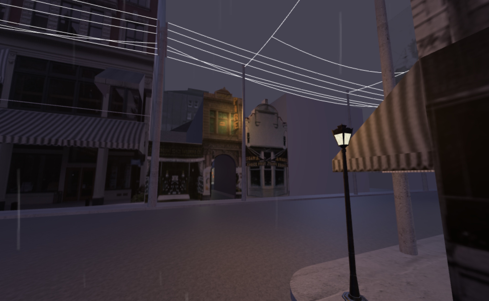

# Seeing Lost Enclaves
### Relational reconstructions of erased historic neighborhoods of color

_This is a draft. The final version will be published in September 2023._

## Part 1: Research

This is a guide to finding and gathering clues to places which have been erased; neighborhoods and communities who were not included in archives during their time, and whose traces we can find mostly through the in-between glimpses, the cracks and gaps, the unsaid and the hidden away. Most of what we find through this process is not the real story. It’s the selective forgetting, overwriting, and reshaping of histories, *despite* which we will try to see people, their spaces, and the things they cared about. 

_A reconstruction of the Empire Theater, facing Providence's Chinatown in 1914, on a rainy evening._

It's the first part of an evolving guide to [relational reconstruction](relational-reconstruction.md), a set of practices for creating an immersive (virtual, 3D) reconstruction of an erased neighborhood, such as the one I have begun to craft in the [Seeing Providence Chinatown project](https://unterbahn.com/chinatown), about the neighborhood which existed on Empire Street in Providence, RI until December 1914. 

This guide will continue to grow and change as the project emerges. 

----

## Contents

<!-- * [Introductory blog post](blog/01-introduction.md) -->

* Introductory blog post (coming soon)
* [Questions](research/questions.md)
* [Searching for images](research/images.md)
* [Mapping photos](research/mapping.md)
* [Tracking photos](research/tracking.md)
* [Bibliography](research/bibliography.md)
* [Image collection](research/collection.md) (selected public domain images)
* [Related work / inspirations](inspirations.md)
* [Frequently Asked Questions](faq.md)

----

## What kind of project is this?

This project, and the [relational reconstruction](relational-reconstruction.md) methodology I envision, is focused on memory, remembrance, and personal relationships to histories. It is not a work of history or formal archiving (see "Is this a precise historic recreation?" in the [FAQ](faq.md)), but a way for us to reckon with the past and its meanings to us today and in the future, in personal terms.

Think of this as a journey through these materials which you can chart with love, perhaps guiding your community around the hazards and pitfalls of the archival lens, to be close with – to share space with – histories and spaces which we often must glimpse through the cracks. 

It's a meditation, the searching. Handling these artifacts with tenderness. Not picking them apart like meat from a bone or gems from the soil. Gathering them together with gentle hands. Healing yourself as you glimpse them. Giving them recognition, and rest. 

<!-- (Add: note on personal vs. scholarly discovery) -->

<!--

## What is this guide for? 

Where LOC materials meet local and family collections
2 track: for spatial reconstruction, vs. story/life
Maps and stories, then photos and articles…

-->

### A note of caution

To those beginning to look through these histories: please take care of yourself. In this work, you’ll come across material which will be painful to read, including violence, but also the diminution of violence – even from present day historians and archivists. There will be people who don’t understand this pain or how they can add to it. Take breaks and deep breaths. Listen to something calming. The kind of justice we seek in relational reconstruction is through remembrance and connection. It may be someone else’s important work to hold themselves accountable for these acts. It may even be yours on another occasion, but our goal here and now is to see beyond those painful parts to try to connect with people’s lives; people who might be your ancestors, or who walked a path your ancestors would later. (Also: see this episode of NPR’s [Life Kit: Connect with your ancestors](https://www.npr.org/2022/11/11/1136051123/connect-with-your-ancestors))

