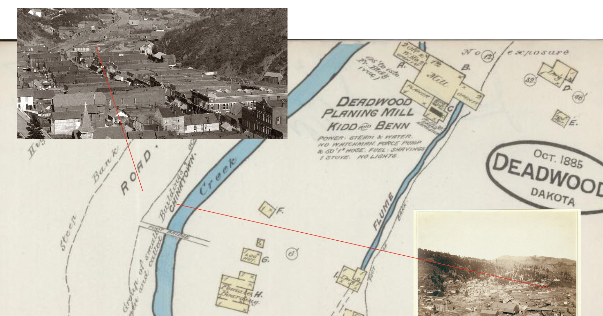
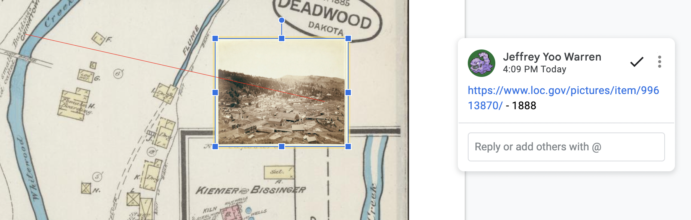
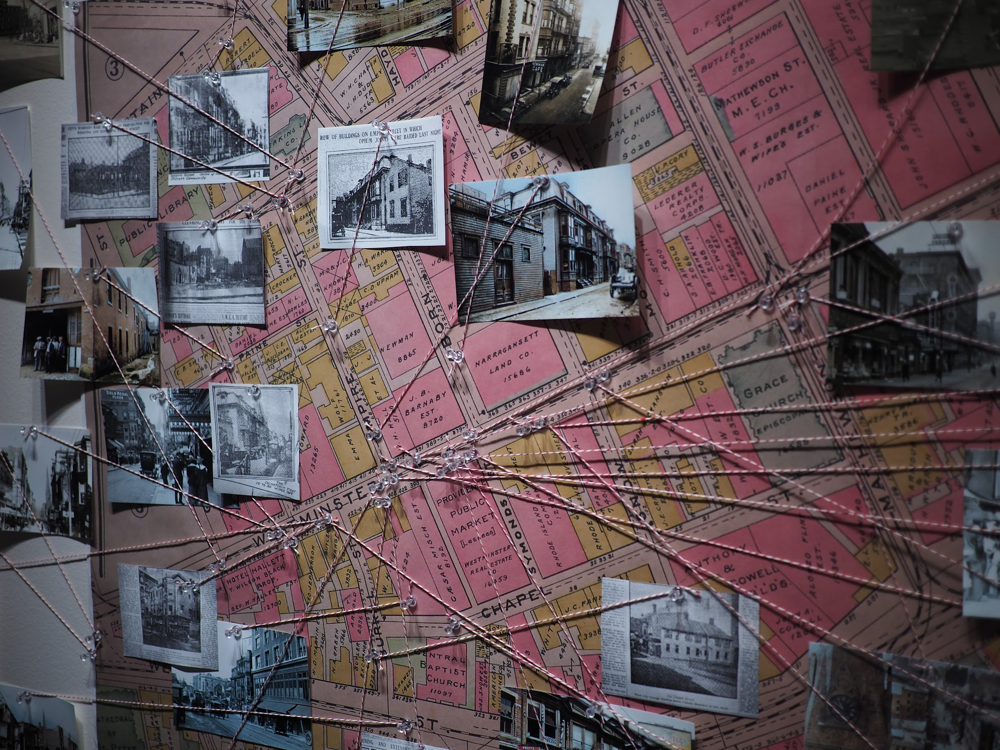
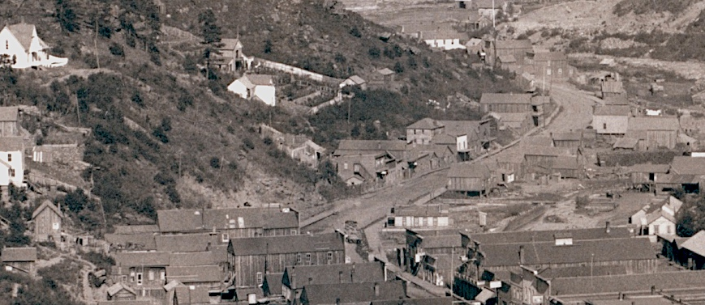

# Mapping photos

## Organizing photos on a map

As you collect more and more photos, you'll need to keep track of what each photograph represents, spatially. Placing them onto a map can be a powerful means of organizing what you know and don't know. 

Start with any initial photos you have. Can you locate the buildings in a photo on the map? It can be helpful to copy paste (or drag) images into a Google Presentation, like this: [Link to zones map]()

Each time you find a new image, add it (or a thumbnail version of it) to the map:

_You could also do this with thumb tacks or tape on your wall._

1. Place your image off to the side, then draw a thin line from a specific point in the image to where you think that appears on the map.
2. You can also mark where the photo was taken and draw an arrow in the direction it faces.
3. Then, to remember where you got it, leave a comment on the image with, at least, a link to its source.

_You'll track this image in more detail elsewhere; this is just to remember where it appears spatially._

As you find more images, you can start to see which buildings you haven't yet been able to see in a photograph, and how good a photo source you have for each building.

_If you're tracking this on a real tack board, you can write references on a post-it or on the back of the photo._

## Working without a map

Some places, like Truckee, CA, in the 1870s, or Deadwood, SD in the 1880s, I haven't been able to find a map of buildings of Chinatown for the time period I'm seeking. The same process could work with an overhead view of an area, if that can be found.

_Excerpt from [Deadwood, [S.D.] from Mrs. Livingston's Hill](https://www.loc.gov/pictures/item/99613869/); between 1887 and 1892, Library of Congress._

[Next: Tracking photos >](/research/tracking.md)
