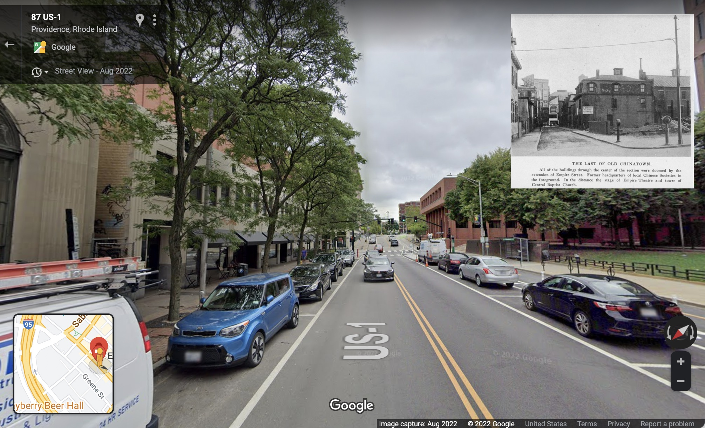

# Questions

Before beginning a project like this, I think it's healthy to think about what already exists, who's been listening for and collecting stories in a place, and, to guide one's own steps, to map out unknowns. The following questions may help guide you through the first step of this process, which is understanding the place you have chosen to relationally reconstruct.

At the beginning, many of these questions will be hard to answer; that's OK – just bear them in mind as your work continues. 

----

First, if you can, visit the place as it is today. It might be a virtual visit, or maybe a visit through scenes in a movie set in the place. For some places, I visited using Google Street View. 

 
_The site of Providence, Rhode Island's Chinatown before 1914, with reference photograph._

What does the place mean to you, now? How does it make you feel? What does it mean to people present today? These things may change as your project emerges, so it's good to note them now. 

### Do people still live here who remember the place you’re seeking to reconstruct?

Do they have stories about the place? Do they live nearby? Have they written books, or made recordings about it? Are there other ways their stories may be preserved?

Are descendants of the people of this time and place living nearby today? In Providence, I was grateful to meet and in some cases work together with descendants of Providence's Chinatown and Chinese American community. It can be hard to know the right moment; I felt cautious about reaching out before I'd done some work and had something to offer. But there are stories you can only learn from descendants, and their involvement, approval and perspectives are central to the work.

#### Resources:

* [Chinese Railroad Workers Descendants Association](http://www.goldenspike150.org/)
* [Remembering the Forgotten Chinese Railroad Workers](https://www.sapiens.org/archaeology/chinese-railroad-workers-utah/) by Veronica Peterson 
* [How Tacoma’s small Chinese community reckoned with the city’s anti-Chinese history](https://www.seattletimes.com/seattle-news/how-tacomas-small-chinese-community-reckoned-with-the-citys-anti-chinese-history/) discusses the story of the Tacoma Chinese Reconciliation Park.

### Who else lived here, originally?

How are their stories entwined in the history of this place? In our lives? What are our responsibilities towards them in this work? 

#### Resources:
* [Prairie Lotus](https://loc.gov/item/2020945474) by Linda Sue Park, is accompanied, on her website, by a Native American resource guide compiled by author and educator Andrea Page (Oceti Sakowin Hunkpapa), about the Oceti Sakowin people of the area in which the book is set. 
* [Empire's Tracks, Indigenous Nations, Chinese Workers, and the Transcontinental Railroad](https://www.loc.gov/item/2018038417), by Manu Karuka.

### What can we know about peoples' lives at the time and place of our project?

Are there memoirs, stories, or media, especially by members of the community, which could offer a contemporaneous view of the neighborhood in their own words? 

Apart from, or in the absence of such accounts, what are the limitations of White accounts of this community? How might we see past such limitations, or through such gaps? How do we imagine a world unenclosed by what archives chose to remember?

#### Resources:
* [We Still Can’t See American Slavery for What It Was](https://www.nytimes.com/2022/01/28/opinion/slavery-voyages-data-sets.html), by Jamelle Bouie, discusses the limitations of understanding the lives of those enslaved during the trans-Atlantic slave trade through data-driven records and the accounts by enslavers.
* [Venus in Two Acts](https://www.moma.org/collection/works/427132), by Saidiya Hartman (content warning: extreme violence and dehumanization) 

### What can we reconstruct from formal records?

Business directories, newspaper articles, insurance maps, and advertisements (see _Starting points_ in the [bibliography](/research/bibliography.md)) can offer clues to who lived and worked at specific addresses. What were some key addresses/homes/businesses? Did street names change over time? Read on to learn some ways of organizing this knowledge. Also see the section about [tracking photos in spreadsheets](tracking.md).

[Next: Searching for Images >](/research/images.md)
