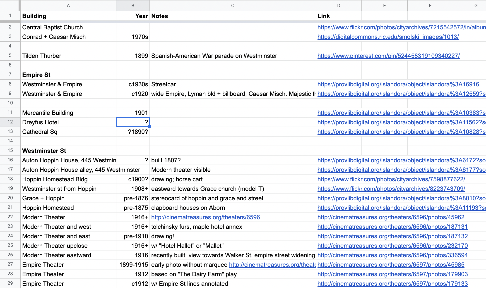
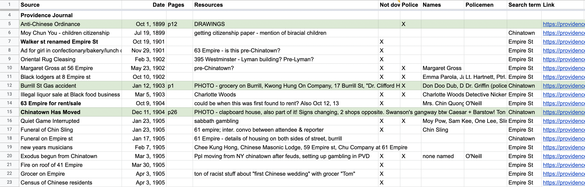
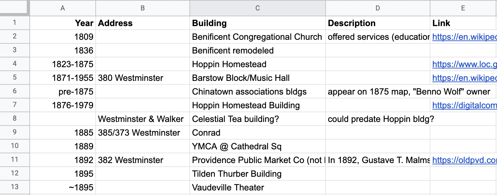

# Tracking photos

In researching Providence's Chinatown, I found that I quickly collected dozens, and eventually hundreds, of photos, as well as web pages and archives I needed to follow up on. Tracking where each one came from, which I wanted to return to for a more detailed look, and anything else about the images, quickly became a challenge. 

I'm sharing access to my original spreadsheet so you can see how I organized my record keeping, and will also share templates (below) which you can use to organize your own. You don't have to use my system, but I'll share how it works and why. 

> [My photo tracking spreadsheet for Providence's Chinatown](https://docs.google.com/spreadsheets/d/1QN0UFXkYftnWY7G6bLlgcGm2uxCsbUcyRMfKfj_6y90/edit#gid=0)

First, it's a working document, not a formal bibliography, so my priority was recording as much as I could, but it's not a "perfect" document, whatever that means. 

_My photo tracking spreadsheet for Providence's Chinatown._

## Templates 

* [Template]()

_Spreadsheet noting buildings by construction/destruction dates, addresses, building or business names, notes and links._

## Why: possibilities

Using these tracking spreadsheets: names, directories...

Jamelle Bouie

_Spreadsheet noting buildings by construction/destruction dates, addresses, building or business names, notes and links._

## Build a rough timeline

As you learn more about the history of the place, take note of dates relevant to your search (as distinct from events relevant to the community) -- for example, when street names changed, when diasters or attacks occurred, when businesses visible on the street moved in or closed. I keep a short running list of these in an "overview" tab of my spreadsheet, as a quick reference when interpreting photos and maps. When a street name appears differently on a map or in a news articlefor the first time, I note that the street name changed between that and the prior mention.

### Buildings and landmarks

In researching Truckee, California's Chinatown, I noted a tower with distinctive columns on the hill above the site of Chinatown. Unfortunately, it was owned by a famously racist leader of the white supremacist group responsible for expelling Chinatown. In this case, the tower serves as an important landmark for dating photographs. 

According to a plaque on the site, the tower was built in 1895, which was about 17 years after the first Chinatown of Truckee was destroyed in a fire. So any photos of the area showing the tower are too late to show Chinatown at that site. 

### Names of buildings

Buildings with unique names, or with uniquely named businesses (a hotel, theater, or restaurant, for example) make for good search terms. Note if possible when the buildings were built, torn down, or modified, or when businesses opened, closed, or changed names.

### Street names

Changing street names can be challenging to track, but can also narrow your search to a specific time range. In Providence, Empire Street was called Walker Street until 1901; Paine Street was called Shimbo Alley starting sometime in 1911. These dates can serve as search terms for specific time ranges, and help to date maps and photographs.

### Other timeline clues

Cars, telegraph wires, and other infrastructural changes can all help to establish dates in photographs, and keeping a list of these at hand in your tracking spreadsheet or notes is also helpful.

[Next: Tracking photos >](tracking.md)
