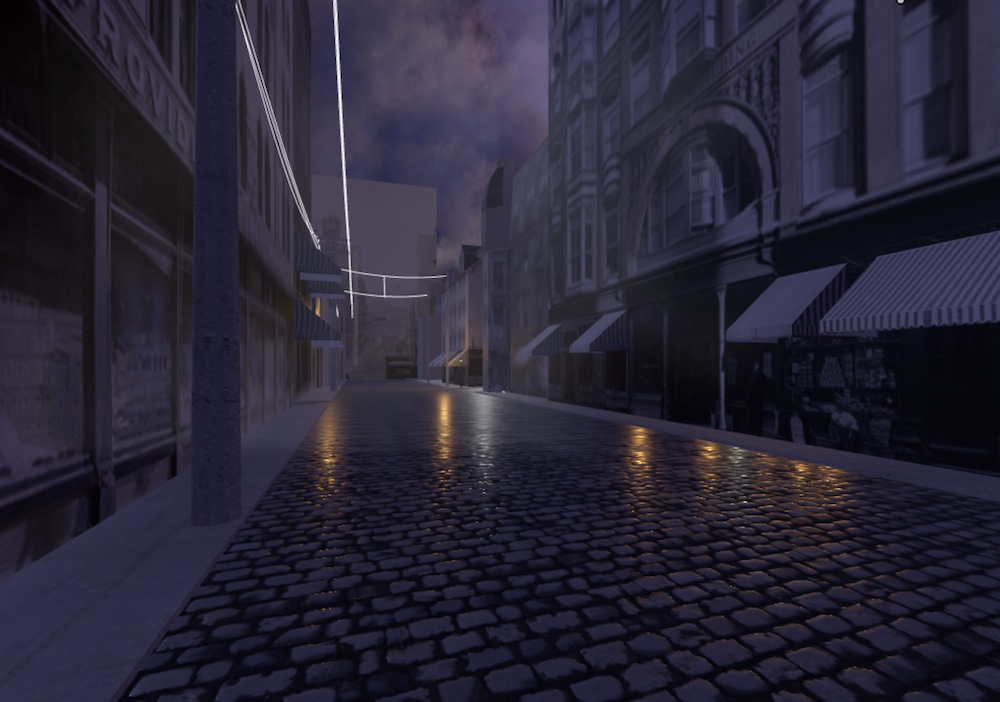
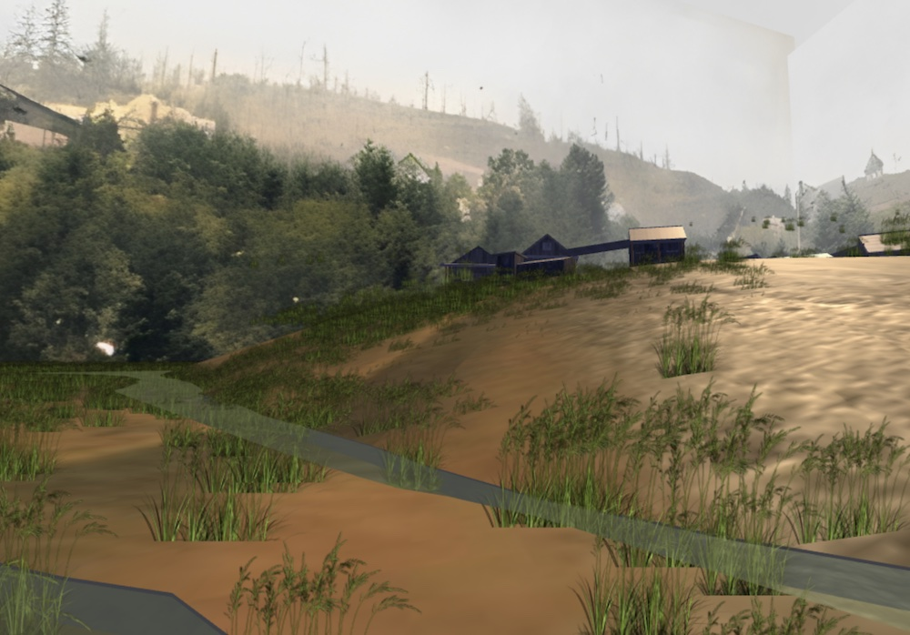

# Sites

On this page you’ll find links to two of the sites I’ve worked on as part of Seeing Lost Enclaves. These spaces are shared - you may encounter other people on their own virtual visits. 

## Be sensitive to other visitors and to yourself

Please bear in mind that for some visitors, especially Asian American visitors, or descendants of those who lived in these spaces, this visit may be connected to difficult histories and may inspire complex feelings. Some may be grieving these spaces. Some may be seeking to re-connect, or to feel a sense of belonging. 

Asian American and Asian Diaspora visitors are the primary audience and our experience of the space takes priority. I’d like to ask that as you visit, you offer others space and respect, just as you show respect to the stories and communities which are represented here. 

As you enter you’ll see a waiting area, in which you’ll be prompted to choose an “avatar” — a body to represent you in the reconstructed virtual space. In choosing an avatar, please consider how your presence in the space will transform it, with the above considerations in mind. 

Please reach out via the contact page if you have questions or would like to discuss any of this further. 

[Providence Chinatown in 1914](https://hubs.mozilla.com/4UjiDyv/seeing-providence-chinatown-1914-sep-13-23#Theater)

[Portland Chinese Vegetable Gardens, c1900](https://hubs.mozilla.com/EVBFqvG/portland-chinese-vegetable-gardens-sept-23#Grove)
 
(developed in collaboration with [Dri Chiu Tattersfield](https://hellodri.itch.io/) **)

 
 
 

