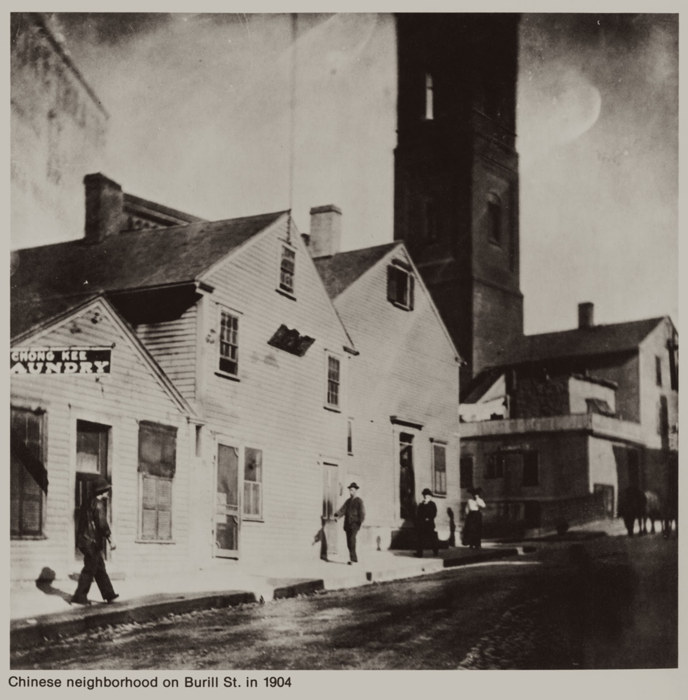
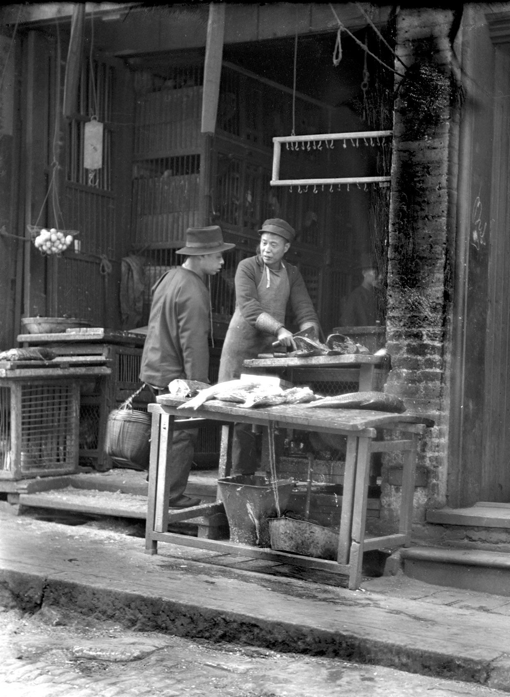
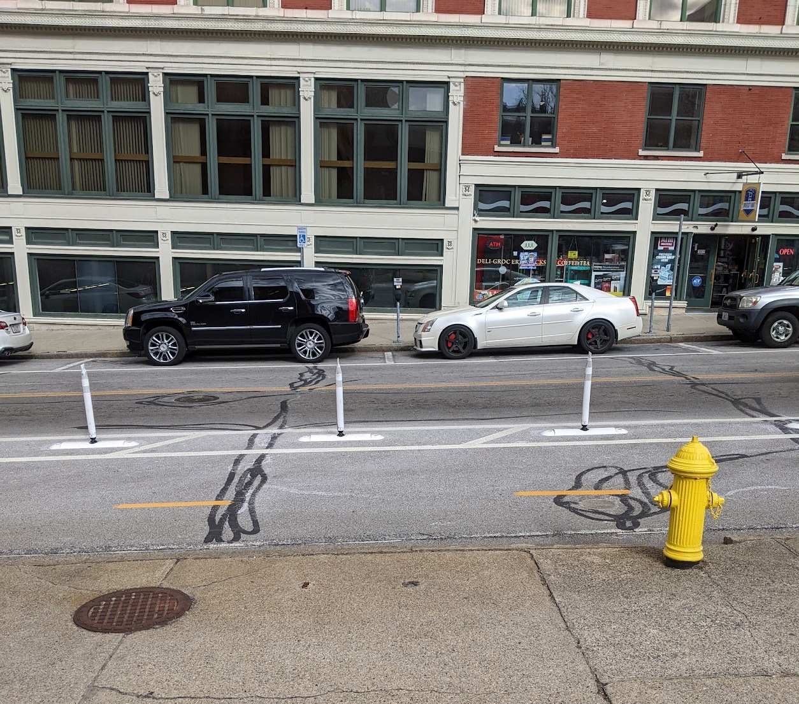

# Seeing Lost Enclaves
### Relational reconstructions of erased historic neighborhoods of color

_This is a draft. The final version will be published in September 2023._

## Part 4: Soundscapes

For this part of the guide I worked with artist and friend [Ann Chen](https://annhchen.com/) on how to create historical soundscapes to go with your relational reconstructions.  

So far, we've focused on gathering, editing and reconstructing these spaces using visual imagery from archives, personal sources or the internet. Adding sound to your reconstruction can be a powerful method to augment a visitor's experience of your space and also reconnect with memories and histories. At a basic level, the ambient sounds of a neighborhood help to create a sense of "being there," from the noise of traffic, to the blowing of the wind, to the sounds of people talking, doing things, and spending time together.   

_Intersection of Burrill and Chapel Street, Providence, in 1904; courtesy Larry Depetrillo._ 

Searching for high quality sound recordings from our past can often be more difficult than searching for historic images or films. Introducing sounds into your environment, and composing a [soundscape](https://en.wikipedia.org/wiki/Soundscape) can be challenging when so little material exists.  

A solution we've come up with, is to take a speculative approach to sound design. When the audio recordings you need don't exist, how can we rely on other sources such memories, texts, descriptions, images, oral histories--to recreate the soundscape of the past?  

In this section, we will introduce some exercises, suggestions and tips on how to listen, record and stitch together sounds to add to your environment.  

_A fishmonger and customer. Cropped [from original](https://www.loc.gov/item/2005693789/) in [Specific Subject File filing series](https://www.loc.gov/item/2005675764/), Print and Photo Division, Library of Congress._ 

## "Deep listening" with a photograph  

If sounds from the neighborhood or place you are creating are not easily accessible, we can start with images, texts, descriptions, oral histories or other sources and ephemera. For this example, we will use a photograph from the Library of Congress of a fish market in San Francisco's Chinatown.  

Take a few minutes to study this photograph. Write down every detail you can see in the image. Try to be as descriptive as possible. If there are people in the photo, what are they doing? What are they wearing? Now, try to imagine the types of sounds that are associated with these details.   

In this photograph, a young man in a wide brimmed hat, holding a basket is looking down at a piece of fish on the table. The fishmonger standing next to him is looking at him in mid chop. They look like they are in the middle of a conversation.  

_Closeup of the two men talking, from previous photograph._ 

Write down every detail that you see in the image. Be descriptive in the action. 

And then imagine, what kinds of sounds relate to this detail or action.

Are these sounds you can recreate yourself?   

Could you try chopping a fish, or rattling a metal bucket on a wooden floor?  

Can you use keywords to find these sounds in public archives?  

You can find a lot of free to use sounds at the website [Freesound.org](http://freesound.org), like this recording of chickens: [https://freesound.org/people/elkinjn/sounds/500637/](https://freesound.org/people/elkinjn/sounds/500637/), or this recording by Miranda Huang titled "Chinatown Sidewalk": [https://freesound.org/people/MirandaHuang/sounds/232281/](https://freesound.org/people/MirandaHuang/sounds/232281/).  

Let's focus on other clues in this photo. It is on a street. What does a busy street sound like in a shopping district? Do we know what languages are spoken in this neighborhood? Can we go out to record these specific sounds?  

Once you've gathered a list of sound descriptions, now comes the fun part. Let's go sound gathering!  

_The site of the grocery and shops on Burrill Street, Providence, in 2023, on what is now Empire Street._ 

## Listening and Recording the Place Today  

If visiting the site you are reconstructing is possible, we recommend going there and listening to the present day sounds (even if they've changed). Try visiting at different times of day, different times of the week, and if you can, different times of the year.  

For this example, I visited the site of Burrill Street Chinatown in Providence and recorded some environmental sounds.   

This is a clip of what it sounds like today.   

(embedded audio)  

Ann: So Jeff, what was your experience visiting the present day site? What kind of thoughts were running through your head?  

(embedded audio)  

_The same spot viewed from the sidewalk on Empire Street. The building across the street existed in 1914, but would have been blocked by Chinese American shops and lodgings, as well as the Empire Theater._ 

_The reconstructed site with atmospheric additions such as puddles and fog. See the Atmosphere section of the guide._ 

From this kind of deep listening -- both at the site as it is today, and through close attention to images from the period we're interested in -- we can collect a range of different sounds which, together, can create an immersive soundscape for our reconstructed space.   

## Spatialized sound in Mozilla Hubs  

After you collect sounds, you can place them within a reconstructed scene. Much of the reconstruction work so far in Seeing Lost Enclaves has been in the virtual online platform called Mozilla Hubs. Mozilla Hubs is able to host not only 3D models and visual media, but embedded sounds located within the virtual environment. These sound files are spatialized -- meaning that, just like in real life, they are louder the closer you are to them. And if you wear stereo headphones, you can hear a sound to your left or right side. This allows us to localize sounds in creative ways.   

_A sound file playing on a loop, hidden behind a wall in a virtual reconstruction of Providence's Chinatown._ 

For example, in the reconstruction of Providence's Chinatown in 1914, I hid different sounds around the scene, such as the sound of rain hitting the street. I placed these sounds outdoors, or behind walls, and when you went inside, they seemed to get quieter. In reality they were just placed away from buildings, but the effect was such that visitors felt sheltered from the rain once they stepped indoors.   
  

_Another sound file, hidden just outside the top floor of a reconstructed building in Providence's Chinatown, to provide sounds audible most clearly from the upper floors of the building._ 

  
## Conclusion  

Whether we're composing a single sound file as the soundtrack of a video, or placing different recordings around a 3D scene, all the sounds combine to create a sense of place.  

Let's put it all together and see how it sounds.  

<iframe width="560" height="315" src="https://www.youtube.com/embed/9QEmfa2rDso" title="YouTube video player" frameborder="0" allow="accelerometer; autoplay; clipboard-write; encrypted-media; gyroscope; picture-in-picture; web-share" allowfullscreen></iframe>

_A video of a partially completed reconstructed scene of Providence's Burrill Street Chinatown ca. 1900 with a simple ambient soundscape._ 

That's the end of the Guide to Relational Reconstruction; thank you, and [please sign up here](https://unterbahn.com/chinatown/) to be notified about workshops and events related to Seeing Lost Enclaves.
