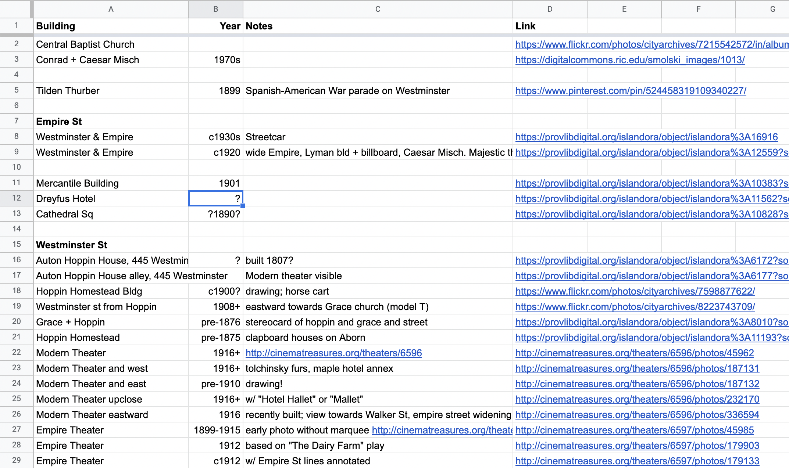
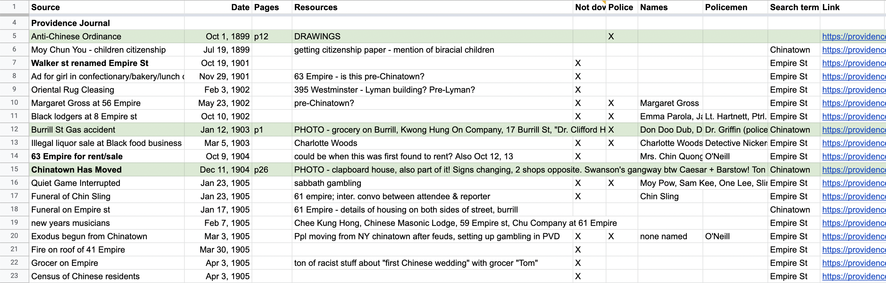
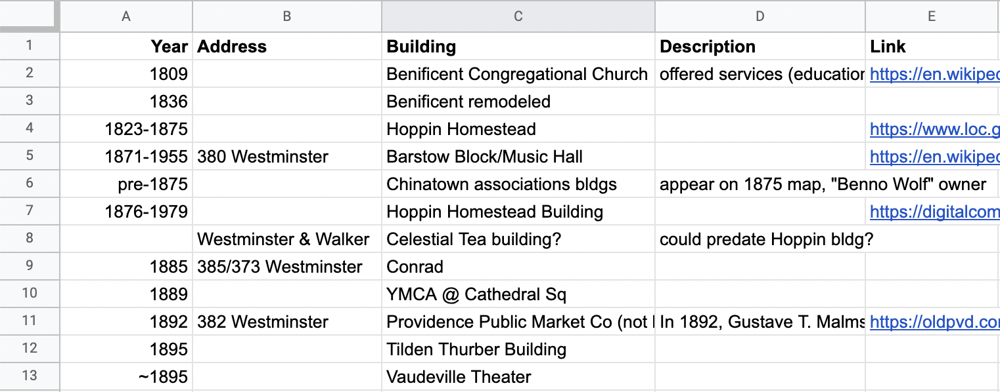

# Tracking photos

In researching Providence's Chinatown, I found that I quickly collected dozens, and eventually hundreds, of photos, as well as web pages and archives I needed to follow up on. Tracking where each one came from, which I wanted to return to for a more detailed look, and anything else about the images, quickly became a challenge. 

I'm sharing access to my original spreadsheet so you can see how I organized my record keeping, and will also share templates (below) which you can use to organize your own. You don't have to use my system, but I'll share how it works and why. 

> [My photo tracking spreadsheet for Providence's Chinatown](https://docs.google.com/spreadsheets/d/1QN0UFXkYftnWY7G6bLlgcGm2uxCsbUcyRMfKfj_6y90/edit#gid=0)

First, it's a working document, not a formal bibliography, so my priority was recording as much as I could, but it's not a "perfect" document, whatever that means. 

_My photo tracking spreadsheet for Providence's Chinatown._

## Templates 

* [Template]()

_Spreadsheet noting buildings by construction/destruction dates, addresses, building or business names, notes and links._

## Why: possibilities

Using these tracking spreadsheets: names, directories...

Jamelle Bouie

_Spreadsheet noting buildings by construction/destruction dates, addresses, building or business names, notes and links._

## Build a rough timeline

As you learn more about the history of the place, take note of dates relevant to your search (as distinct from events relevant to the community) -- for example, when street names changed, when diasters or attacks occurred, when businesses visible on the street moved in or closed. I keep a short running list of these in an "overview" tab of my spreadsheet, as a quick reference when interpreting photos and maps. When a street name appears differently on a map or in a news articlefor the first time, I note that the street name changed between that and the prior mention.

### Buildings and landmarks

In researching Truckee, California's Chinatown, I noted a tower with distinctive columns on the hill above the site of Chinatown. 

Her grandfather brought increased attention to the stone when he built a renowned Donner Party and butterfly museum over the rock in 1893.

(plaque says 1895)

Immediately after purchasing the Rocking Stone property in 1891, McGlashan began to worry that the precariously balanced boulder would roll off its perch and injure the children that regularly played at its base.

The McGlashan mansion, often referred to as the "Crystal Palace," burned down in 1935

https://www.moonshineink.com/opinion/the-rocking-stone-and-the-crystal-palace/

## Other things to note

Names of buildings

Changing street names

Short street names

Dates when buildings were built or torn down or modified

Cars, telegraph wires, other infrastructural changes

Regular events & celebrations nearby

[Next: Tracking photos >](tracking.md)
